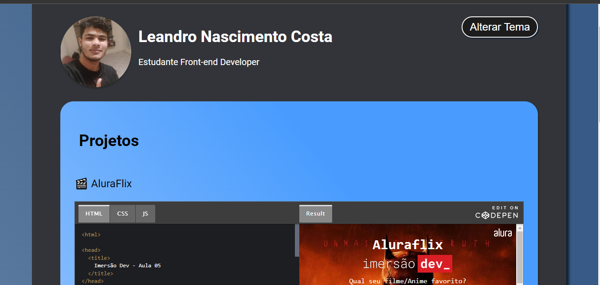

# Certificard

## Aplicação
Para ver o projeto <a target="_blank" rel="external" href="https://leandroncosta.github.io/Certificard/">Clique aqui</a> 

## O que é?
- A aplicação é uma card / Mini portfólio de alguns projetos feitos durante a Imersão DEV da Escola Alura, no qual os participantes sçao desafiados a fazer a aplicação.

## Tecnologias:
- HTML5
- CSS3
- JavaScript 

 
